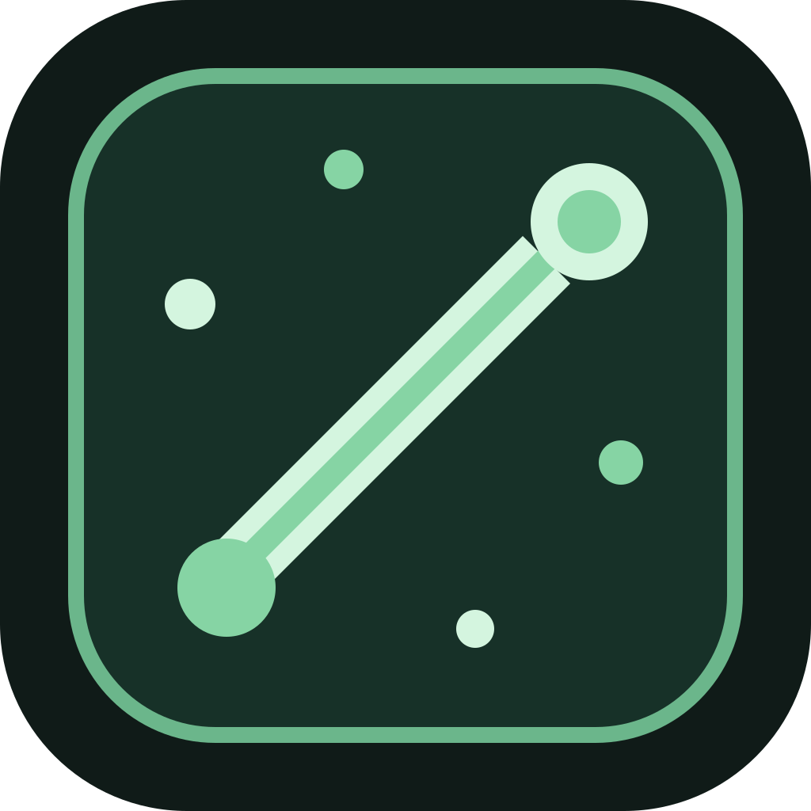

<p align="center">
  
</p>

<h1 align="center">AgentBaton</h1>
<p align="center"><strong>One baton. Every agent.</strong></p>
<p align="center">Organize your AI agent skills by context. Choose what each agent uses.</p>

<p align="center">
  <a href="https://github.com/songzhuozhu/agent-baton/actions/workflows/ci.yml"></a>
  <a href="LICENSE"></a>
  
</p>

<p align="center">English · <a href="README.zh-CN.md">简体中文</a></p>

AgentBaton is a local-first desktop skill manager for AI agents. Discover installed skills, organize them into reusable groups, and independently choose groups for each agent—with a preview before deployment.

**Development preview:** the local management core is implemented; V1 acceptance is not complete. GitHub authorization, conflict resolution, and cross-platform runtime validation still have gaps. Start from source; the desktop UI is currently in Simplified Chinese.

## Why AgentBaton?

Your tools change with the work. An internal development skill, a frontend design skill, and a video-editing skill should not have to travel together.

| Context | Example skill group | How you use it |
| --- | --- | --- |
| Work | Internal APIs, team conventions, project workflows | Select the Work group for your development agent. |
| Personal projects | UI design, frontend polish, full-stack workflows | Switch to Personal, or combine it with shared skills. |
| AI video editing | Editing workflows, captions, media utilities | Select Video for that session's agent. |

A skill can belong to multiple groups without duplicating its managed content. Each agent keeps its own group selection and individual overrides. Change the selection, review the plan, apply it, and restart the agent when required.

The goal is a relevant skill set for each task. Actual context and token costs depend on the agent's loading behavior; this project does not claim measured token savings.

## Features

- **Discover before adopting.** Inspect known user-level skill locations and explicitly added project/custom directories. Adoption creates a managed copy only after confirmation.
- **Group once, reuse across agents.** Use many-to-many groups, independent selections, and per-skill overrides: follow groups, force on, or force off.
- **Keep your own notes.** Search by name, description, or tags. Your notes stay separate from the original `SKILL.md`.
- **Preview deployment.** Review changes, detect conflicting files or installation drift, and apply with per-agent backups and rollback support.
- **Preserve upstream references.** Keep a Git source and baseline commit; preview updates in isolation and explicitly handle local forks.
- **Choose what may sync.** Skills default to `Local Only`. Only `Sync Allowed` skills in participating groups are eligible for the sync snapshot.
- **Recover from changes.** Restore deleted managed skills within a 30-day recovery window and undo recent applications when backups remain valid.

The Git sync foundation includes snapshot export, restore, manual fetch/commit/push, and three-way conflict detection. The complete user-facing GitHub sync flow is still under development.

## How it works

1. **Discover** skills in supported locations. Scanning does not adopt or upload them.
2. **Adopt** selected skills after reviewing their source and risk-bearing files.
3. **Organize** skills into groups such as Work, Personal, and Video.
4. **Select** groups for an agent and adjust any individual overrides.
5. **Preview and apply** the proposed changes. Restart the agent yourself if needed.

```text
Installed skills → Discovery → Explicit adoption → Managed library
                                                        │
                                                  Skill groups
                                                        │
                                               Per-agent selection
                                                        │
                                            Preview → Confirm → Apply
```

The managed library is the source of truth. Agent installations, local SQLite state, and the portable Git sync repository are separate. Restoring a sync snapshot does not automatically install skills into agents.

## Agent and platform support

Five adapters are included, with different levels of readiness:

| Agent | Current implementation and limits |
| --- | --- |
| Codex | User-level discovery and managed deployment path; real-version behavior still needs validation. |
| Claude Code | User-level discovery and managed deployment path; native settings and name collisions require version-specific validation. |
| Cursor | Discovery across known skill roots; externally installed skills cannot be assumed safely disableable. |
| OpenCode | Discovery across known skill roots; evolving permission formats need real-version validation. |
| TRAE | Read-only placeholder on macOS/Windows; no automatic discovery/deployment yet. Integration disabled on Linux. |

The desktop targets **macOS, Windows, and Linux**. macOS ARM64 has local build/startup evidence. Windows/Linux ARM64 directory packages have been built, but target-platform runtime verification remains outstanding. The CI badge reports source checks, not agent integration or installer verification.

See the [compatibility research](docs/research/agent-adapter-compatibility-matrix.md) and [acceptance audit](docs/verification/v1-gap-audit.md) for dated evidence and limitations.

## Run from source

Prerequisites: **Node.js 24**, npm, and Git. Electron requires a graphical desktop. Installing dependencies downloads platform-specific packages; native dependencies may require your OS's build tools.

```bash
git clone https://github.com/songzhuozhu/agent-baton.git
cd agent-baton
npm ci
npm run check
npm run dev
```

`npm run check` runs type checking, automated tests, and a production build. It does not launch the desktop or modify real agent installations.

| Command | Purpose |
| --- | --- |
| `npm run dev` | Start the desktop in development mode. |
| `npm test` | Run the test suite. |
| `npm run test:watch` | Rerun tests while developing. |
| `npm run build` | Build the main process, preload, and renderer. |
| `npm run preview` | Launch the current build. |

To build an unpacked application directory, run the corresponding command on the target OS:

```bash
npm run package -- --mac dir
npm run package -- --win dir
npm run package -- --linux dir
```

Output goes to `dist/`. A successful directory build is not a signed installer or evidence of runtime compatibility.

### GitHub sync setup

The GitHub App Device Flow implementation reads `AGENT_BATON_GITHUB_APP_CLIENT_ID` from the application process environment. No production App client ID is bundled; without one, authorization reports that configuration is missing. Providing a client ID alone does not complete pending sync acceptance work.

The [authorization notes](docs/research/github-device-flow.md) describe the implementation and remaining work. Git sync uses a dedicated repository for your selected skills—not this application's source repository.

## Privacy and safety

- Local-first, with no default telemetry or required AgentBaton account.
- No full-disk scan; discovery stays within known or explicitly selected roots.
- No execution of skill scripts during discovery, adoption, sync, or updates.
- `Local Only` takes precedence over group sync settings; tags do not grant upload permission.
- `Sync Allowed` means eligible for your selected repository, not safe for public disclosure.
- Conflicts with protected installations or detected drift are blocked for review.
- Diagnostic exports are user-initiated and exclude skill bodies, credentials, and absolute paths by default.

Static risk indicators are not a security audit of third-party skills. Review the content and trust its source before allowing an agent to use it.

## Current status

The last local verification on **2026-09-12** passed **76 tests across 36 files**, type checking, and a production build.

Work remaining before V1 acceptance:

- [ ] Complete GitHub App authorization and real private-repository transport validation.
- [ ] Connect conflict decisions to the sync transaction and UI.
- [ ] Verify the two-device restore/sync workflow end to end.
- [ ] Validate real agent versions and Windows/Linux desktop behavior.
- [ ] Complete settings, installation details, and remaining deletion/uninstall flows.
- [ ] Complete desktop visual and keyboard-accessibility checks.

Progress is tracked in the [acceptance audit](docs/verification/v1-gap-audit.md). V1 focuses on skill management; agent orchestration, task routing, and third-party adapter plugins are outside its scope.

## Contributing

Bug reports, reproducible agent compatibility reports, UI improvements, and focused pull requests are welcome. Read [CONTRIBUTING.md](CONTRIBUTING.md) before making changes. Include the OS, agent version, expected behavior, and a minimal reproduction when [opening an issue](https://github.com/songzhuozhu/agent-baton/issues); remove private skill content and credentials first.

Project references (currently in Chinese):

- [V1 requirements](docs/requirements-v1.md) · [Domain vocabulary](CONTEXT.md)
- [Architecture](docs/architecture-v1.md) · [Architecture decisions](docs/adr/)
- [Sync format](docs/sync-format-v1.md) · [Development plan](docs/development-plan-v1.md)

If AgentBaton fits a problem you have, a star helps other developers discover it. Concrete feedback helps shape the next release.

## License

[MIT](LICENSE) © 2026 songzhuozhu. Skills managed with AgentBaton retain their own licenses and permissions.
