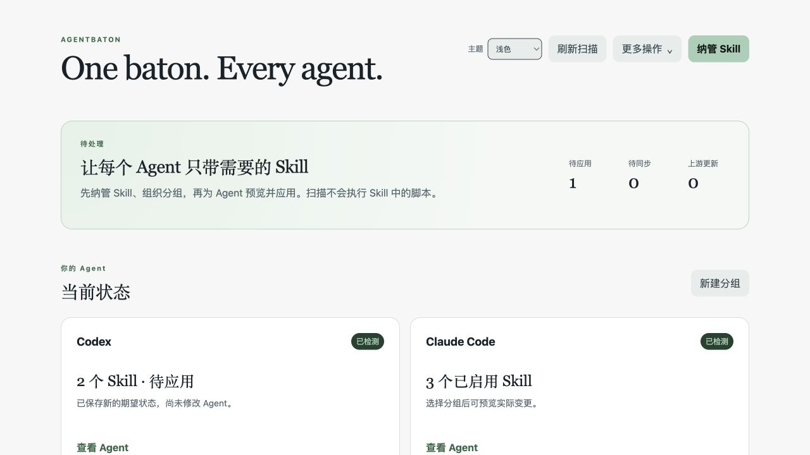

<p align="center">
  
</p>

<h1 align="center">AgentBaton</h1>
<p align="center"><strong>One baton. Every agent.</strong></p>
<p align="center">按场景组织 Skill，为每个 AI Agent 选择需要的能力。</p>

<p align="center">
  <a href="https://github.com/songzhuozhu/agent-baton/actions/workflows/ci.yml"></a>
  <a href="LICENSE"></a>
  
</p>

<p align="center"><a href="README.md">English</a> · 简体中文</p>

AgentBaton 是一款本地优先的 AI Agent Skill 桌面管理工具。发现已安装的 Skill，将它们组织成可复用的分组，为每个 Agent 独立选择分组，并在部署前预览实际变更。

**开发预览：** 本地管理核心已实现，尚未完成 V1 验收。GitHub 授权、同步冲突解决及跨平台运行验证仍有缺口。目前请从源码运行，桌面界面为简体中文。



*界面预览使用隔离的示例数据，展示当前布局，不代表真实 Agent 集成已完成验收。*

## 预览版本

[v0.1.1-preview.1](https://github.com/songzhuozhu/agent-baton/releases/tag/v0.1.1-preview.1) 为**仅源码预览版**，包含分组表单、库筛选、键盘弹窗、操作反馈，以及纳管、Git 同步与恢复修复。本版不附带签名安装包。详见[更新记录](CHANGELOG.md)与[后续路线](docs/roadmap.md)。

已知限制包括：多文件撤销中途失败后的补偿尚不完整，实时发现结果与存储的应用状态可能不一致，直接链接托管库的安装会提前反映库内容变化。建议使用示例 Skill 或已有备份评估本版。完整 GitHub 同步、真实 Agent 和跨平台验收仍未完成。

## 为什么做 AgentBaton？

工作项目、个人开发和 AI 剪辑需要的能力并不相同。公司内部接口规范、前端设计工具和视频处理流程，不必始终一起启用。

| 场景 | Skill Group 示例 | 使用方式 |
| --- | --- | --- |
| 工作开发 | 内部接口、团队规范、项目流程 | 为开发 Agent 选择「工作」组。 |
| 个人项目 | UI 设计、前端美化、全栈开发 | 切换到「个人」组，也可叠加通用能力组。 |
| AI 剪辑 | 剪辑流程、字幕、媒体工具 | 为当前使用的 Agent 选择「剪辑」组。 |

一个 Skill 可以同时属于多个分组，无须重复保存托管内容。每个 Agent 有独立的分组选择和单项覆盖设置。切换分组后，预览变更、确认应用，并在需要时手动重启 Agent。

目标是让每项任务使用更相关的 Skill 集合。实际上下文和 Token 开销取决于 Agent 的加载方式，本项目尚未提供节省 Token 的量化测试。

## 核心能力

- **先发现，再纳管。** 扫描已知用户级目录和明确添加的项目/自定义目录；确认纳管后才创建托管副本。
- **分组复用，独立选择。** 支持多对多分组、各 Agent 独立启用，以及「跟随分组 / 强制启用 / 强制禁用」。
- **保留原始描述。** 按名称、描述、Tag 搜索；个人备注单独保存，不改写原始 `SKILL.md`。
- **部署前可预览。** 展示变更，检测文件冲突和安装漂移；按 Agent 执行备份与事务回滚。
- **保留上游来源。** 记录 Git 地址和基线 Commit，在隔离区预览更新，显式处理本地分叉。
- **选择可同步的内容。** 新 Skill 默认 `Local Only`；只有参与同步的分组内、标记为 `Sync Allowed` 的 Skill 才有资格进入同步快照。
- **支持恢复。** 删除的托管 Skill 有 30 天恢复窗口；备份有效时可撤销最近应用。

Git 同步基础已包含快照导出、恢复、手动 fetch/commit/push 和三方冲突检测。完整的用户侧 GitHub 同步流程仍在开发中。

## 使用流程

1. **发现**：扫描受支持的位置，不会自动纳管或上传。
2. **纳管**：查看来源和风险文件，确认后加入托管库。
3. **分组**：按工作、个人、剪辑等场景组织 Skill。
4. **选择**：为某个 Agent 选择分组，必要时设置单项覆盖。
5. **应用**：预览并确认本机变更；需要重启时，由你手动重启 Agent。

```text
已安装的 Skill → 发现 → 显式纳管 → 托管库
                                    │
                               Skill 分组
                                    │
                            各 Agent 独立选择
                                    │
                           预览 → 确认 → 应用
```

托管库是规范内容的来源。Agent 安装目录、本机 SQLite 状态和可移植的 Git 同步仓库相互独立。从同步仓库恢复内容，不会自动给 Agent 安装 Skill。

## Agent 与平台支持

代码包含五个 Adapter，但完成度不同：

| Agent | 当前实现与限制 |
| --- | --- |
| Codex | 用户级发现和托管部署路径已实现；真实版本行为仍需验证。 |
| Claude Code | 用户级发现和托管部署路径已实现；原生设置与同名 Skill 处理需要版本化验证。 |
| Cursor | 支持已知来源目录发现；不能假定外部安装的 Skill 可被安全禁用。 |
| OpenCode | 支持已知来源目录发现；权限格式演进需要真实版本验证。 |
| TRAE | macOS/Windows 当前为只读占位，尚无自动发现/部署；Linux 禁止集成写入。 |

桌面目标平台为 **macOS、Windows、Linux**。macOS ARM64 已有本地构建和启动证据；Windows/Linux ARM64 曾完成目录包构建，但仍缺目标平台的运行验证。CI 徽章代表源码检查结果，不代表 Agent 集成或安装包已验证。

详细依据见[兼容性研究](docs/research/agent-adapter-compatibility-matrix.md)和[验收审计](docs/verification/v1-gap-audit.md)。

## 从源码运行

准备 **Node.js 24**、npm 和 Git。使用 nvm 的开发者可在项目目录执行 `nvm use`，仓库已提供 `.nvmrc`。Electron 需要图形桌面环境。安装依赖会下载平台相关组件，原生依赖可能需要操作系统的编译工具。

```bash
git clone https://github.com/songzhuozhu/agent-baton.git
cd agent-baton
git checkout v0.1.1-preview.1
npm ci
npm run check
npm run dev
```

上述 checkout 固定到本说明对应的预览版；参与开发时可省略，直接使用 `main`。

`npm run check` 依次运行类型检查、自动化测试和生产构建，不会启动桌面应用，也不会修改真实 Agent 安装目录。

| 命令 | 用途 |
| --- | --- |
| `npm run dev` | 以开发模式启动桌面应用。 |
| `npm test` | 执行测试。 |
| `npm run test:watch` | 开发时持续运行测试。 |
| `npm run build` | 构建主进程、预加载脚本和界面。 |
| `npm run preview` | 启动当前构建结果。 |

在目标操作系统上执行对应命令，生成未封装的应用目录：

```bash
npm run package -- --mac dir
npm run package -- --win dir
npm run package -- --linux dir
```

产物位于 `dist/`。目录构建成功不等于已生成签名安装包，也不等于运行兼容性已验证。

### GitHub 同步配置

GitHub App Device Flow 实现从应用进程环境读取 `AGENT_BATON_GITHUB_APP_CLIENT_ID`。当前未内置正式 App Client ID，未配置时会提示缺少配置。仅填写 Client ID 并不能替代尚未完成的同步验收工作。

[授权说明](docs/research/github-device-flow.md)记录了实现与缺口。配置同步时应使用专门保存所选 Skill 的仓库，与本应用的源码仓库分开。

## 隐私与安全边界

- 本地优先，无默认遥测，不要求注册 AgentBaton 账号。
- 不做整盘扫描，只检查已知或用户明确选择的位置。
- 发现、纳管、同步和更新时不执行 Skill 中的脚本。
- `Local Only` 优先于分组同步设置；Tag 不作为上传授权。
- `Sync Allowed` 表示允许进入所选仓库，不代表可以公开传播。
- 遇到受保护的安装内容冲突或已检测到的漂移时，阻止变更并要求处理。
- 诊断包由用户主动生成，默认排除 Skill 正文、凭据和绝对路径。

静态风险提示不是第三方 Skill 的安全认证。允许 Agent 使用前，仍需审阅内容并判断来源是否可信。

## 当前进度

最近一次本机验证（**2026-09-19**）：**37 个测试文件、121 个测试通过**，类型检查和生产构建通过。

V1 验收前仍需完成：

- [ ] GitHub App 授权和真实私有仓库传输验证。
- [ ] 冲突决议界面及其与同步事务的连接。
- [ ] 双设备同步与恢复的完整验证。
- [ ] 真实 Agent 版本及 Windows/Linux 桌面运行验证。
- [ ] 集中式设置、安装详情及剩余删除/卸载流程。
- [ ] 完整桌面的视觉和键盘可访问性检查。

以[验收审计](docs/verification/v1-gap-audit.md)跟踪实际进度。V1 聚焦 Skill 管理；Agent 编排、任务分发和第三方 Adapter 插件不在首版范围内。

## 参与贡献

欢迎提交可复现的问题、真实 Agent 兼容性报告、界面改进和范围明确的 PR。开始前请阅读[贡献指南](CONTRIBUTING.md)。[提交 Issue](https://github.com/songzhuozhu/agent-baton/issues) 时，请提供操作系统、Agent 版本、预期行为和最小复现步骤，并先去除私密 Skill 内容和凭据。

更多项目资料：

- [V1 需求](docs/requirements-v1.md) · [领域术语](CONTEXT.md)
- [总体架构](docs/architecture-v1.md) · [架构决策](docs/adr/)
- [同步格式](docs/sync-format-v1.md) · [开发计划](docs/development-plan-v1.md)

如果 AgentBaton 也能解决你的问题，欢迎 Star，帮助更多开发者发现它。具体的使用反馈会帮助确定后续优先级。

## 许可证

[MIT](LICENSE) © 2026 songzhuozhu。被管理的 Skill 仍遵循各自的许可证和使用权限。
