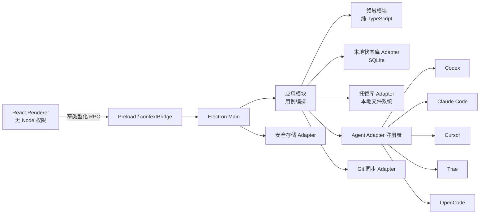

# AgentBaton V1 技术架构

> 状态：已采用\
> 技术路线：Electron + React + TypeScript + SQLite

## 1. 选型结论

V1 采用 **Electron 主进程 + 受沙箱保护的 React 渲染进程 + TypeScript 领域核心 + SQLite 本地状态库**。

选择理由：

- AgentBaton 需要可靠的跨平台文件系统访问、原生对话框、受控子进程、SQLite、Git 以及操作系统凭据保护。Electron 的主进程可承载这些本机职责，而渲染进程可保持为无 Node 权限的界面。
- 当前开发环境已有 Node.js，而没有 Rust 工具链。Electron 让 V1 的核心逻辑、测试和 UI 使用同一语言，降低首版跨平台交付风险。
- Electron 官方要求使用 context isolation 和受限 IPC；这与“不执行 Skill 内容、所有写入可预览”的安全模型匹配。
- Electron `safeStorage` 在 macOS 使用 Keychain、Windows 使用 DPAPI、Linux 使用 Secret Service。Linux 未检测到安全存储或返回 `basic_text` 时，AgentBaton 禁止保存 GitHub 凭据并提示用户配置 Secret Service；不使用明文回退。

官方依据（访问日期：2026-08-09）：

- [Electron 安全指南](https://www.electronjs.org/docs/latest/tutorial/security)
- [Electron Context Isolation](https://www.electronjs.org/docs/latest/tutorial/context-isolation)
- [Electron 进程模型](https://www.electronjs.org/docs/latest/tutorial/process-model)
- [Electron safeStorage](https://www.electronjs.org/docs/latest/api/safe-storage)

## 2. 总体结构



渲染进程永远不直接读写用户目录、数据库、Git 仓库或系统凭据。`preload` 只向 `window.agentBaton` 暴露按用例划分的窄方法，例如 `scanAgents()`、`previewApply()`、`confirmApply(planId)`；不得暴露通用文件读写或任意 IPC 通道。

## 3. 模块与 Seams

### 3.1 `domain` 模块

`domain` 是最深的模块：调用者只提供 Skill、Group、Desired Agent State 和 Observed Agent State，便可获得确定性的有效 Skill 集合、同步快照选择结果、冲突和 Apply Plan。它没有 Electron、文件系统、数据库、Git 或网络依赖。

关键 Interface：

- `resolveEffectiveSkills(input): EffectiveSkillSet`
- `selectSyncSnapshot(input): PortableSnapshot`
- `planApply(input): ApplyPlan`
- `mergePortableSnapshots(input): MergeResult`
- `classifyInstallationDrift(input): DriftStatus`

### 3.2 `application` 模块

`application` 以用例为 Interface，协调领域决策和副作用：扫描、纳管、预览应用、确认应用、同步、检查更新、删除、恢复和导出诊断包。它接受依赖，不直接创建依赖。

### 3.3 `AgentAdapter` Seam

每个 Agent Adapter 实现相同 Interface：

```ts
interface AgentAdapter {
  readonly agent: AgentKind;
  detect(): Promise<AgentDetection>;
  discover(scope: DiscoveryScope): Promise<DiscoveredInstallation[]>;
  assess(skill: CanonicalSkill): Promise<CompatibilityAssessment>;
  plan(input: AgentPlanInput): Promise<AgentPlan>;
  apply(plan: AgentPlan, transaction: FileTransaction): Promise<AgentApplyResult>;
  verify(expected: DesiredAgentState): Promise<AgentVerification>;
}
```

Adapter 的实现可以不同，但不得让差异泄漏到 `domain`。当原生能力不足、路径或同名规则造成歧义、或文件无法安全写入时，Adapter 返回只读、警告或不兼容，不能猜测性修改用户文件。

具体的路径、配置字段和平台约束以[官方 Agent Adapter 兼容性矩阵](./research/agent-adapter-compatibility-matrix.md)为准。桌面壳支持三平台不代表每个 Agent 都在三平台拥有完整写入集成；例如 TRAE 在 Linux 上没有官方客户端支持证据，V1 必须显示不兼容而不能伪造检测或部署结果。

### 3.4 基础设施 Adapter

| Adapter | 职责 | 关键限制 |
|---|---|---|
| `LocalStateStore` | SQLite 迁移、设备状态、应用记录 | 不进入 Git |
| `ManagedLibrary` | 规范 Skill 内容、暂存、回收站 | 不执行内容；拒绝路径逃逸 |
| `FileTransaction` | 预检、备份、原子替换、回滚 | 每个 Agent 独立事务 |
| `SyncRepository` | 读写可移植声明、Git 比较与提交 | 不保存凭据；不推送未解冲突 |
| `SecretStore` | GitHub 授权令牌加密保存 | Linux 无安全存储时拒绝保存 |
| `UpstreamClient` | 只读检查与暂存上游版本 | 不自动写入托管库 |

## 4. 安全模型

- Electron 窗口设置 `contextIsolation: true`、`sandbox: true`、`nodeIntegration: false`。
- 所有 IPC 输入经 Zod schema 验证；主进程实施能力检查，不能把安全判断委托给 UI。
- Skill 扫描只读取目录与文件元数据、文本，不运行脚本、二进制或 `SKILL.md` 中的命令。
- Managed Library 和暂存目录对每个文件进行相对路径规范化；拒绝 `..`、绝对路径、逃逸型符号链接及特殊文件。
- 应用前用哈希预检当前 Installation；变化则废弃旧计划并要求重新预览。
- 所有写入使用 `FileTransaction` 备份并记录；不得自动重启、关闭或调用目标 Agent。

## 5. 数据持久化

SQLite 是设备状态的唯一持久化来源，保存：Agent 检测、Installation、扫描根、操作记录、备份引用、同步连接元信息（不含令牌）、缓存与本机 `Local Only` 元数据。

Managed Library 保存规范 Skill 文件。其路径由稳定 UUID 决定，不依赖用户可变名称：

```text
<app-data>/managed-library/skills/<skill-id>/content/
```

Git 同步仓库保存独立、确定性、版本化的可移植声明，格式见 [同步格式规范](./sync-format-v1.md)。

## 6. UI 信息架构

```text
首页：Agent 卡片 / 当前与期望数量 / 待处理事项
  └─ Agent 详情：已启用分组、有效 Skill、覆盖、预览并应用
Skill 库：发现 / 托管 / 来源 / 风险 / 安装位置
分组：成员、参与同步、影响范围
同步：连接、变更摘要、冲突解决、最近同步
设置：扫描根、Adapter 状态、诊断包、主题
```

首页只回答三个问题：哪些 Agent 可用、哪些状态不一致、下一步是否需要应用或同步。目录结构属于详情页，而不是首页主信息。

## 7. 开发顺序

1. 项目骨架、领域类型、SQLite 迁移、纯领域测试。
2. Codex Adapter 的发现、纳管、分组、预览、受控部署、验证与回滚纵向切片。
3. 通用 `AgentAdapter` 契约和其他四个 Adapter。
4. 同步格式、Git 操作、冲突和新设备 Apply Plan。
5. 上游暂存更新、删除墓碑、回收站和诊断包。
6. React 界面、端到端测试、三平台 CI 和打包。

## 8. 明确不采用

- 不以 Renderer 的 Node 集成换取开发便利。
- 不把 SQLite 数据库或 OS 凭据放进同步仓库。
- 不以“按名称相同”自动合并 Skill。
- 不直接修改外部 Skill 的正文来模拟 Agent 启用或禁用。
- 不实现可加载任意第三方代码的 Adapter 插件系统。
